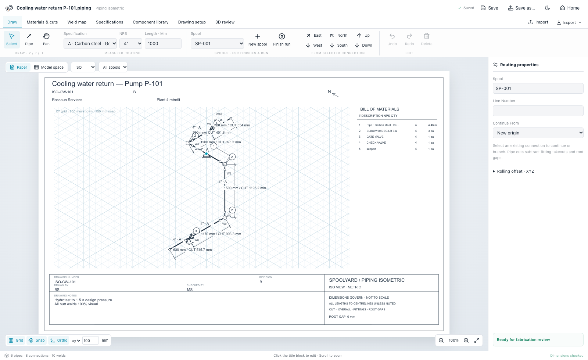
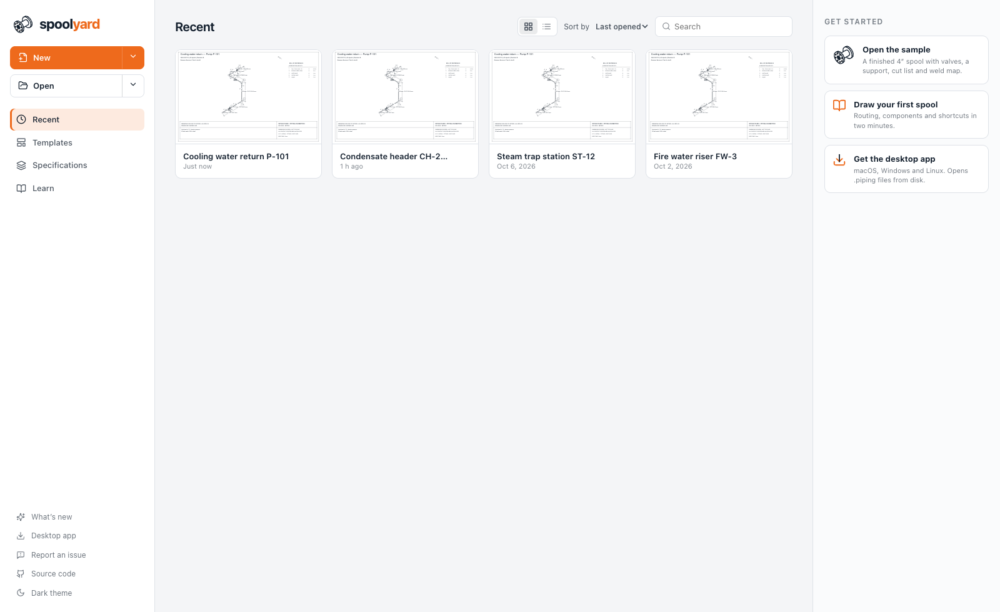
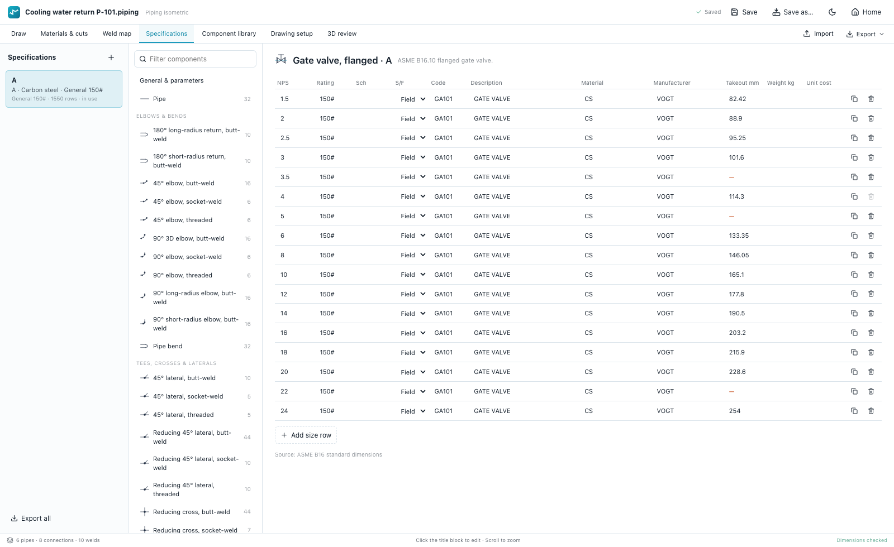
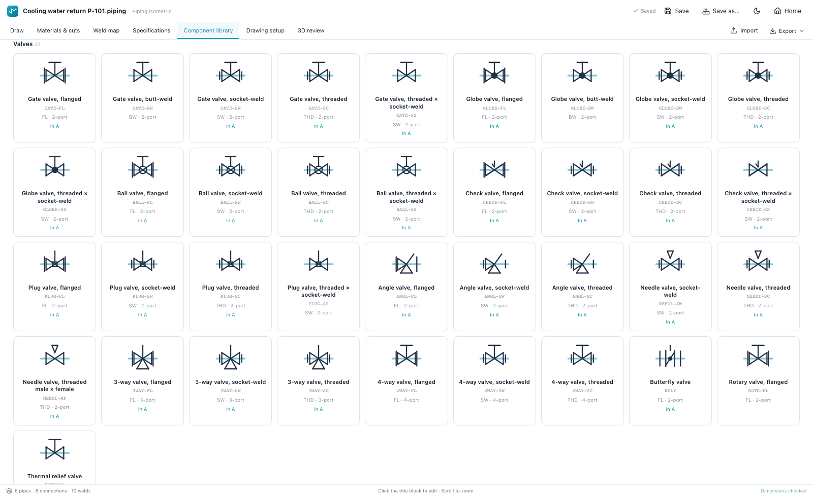
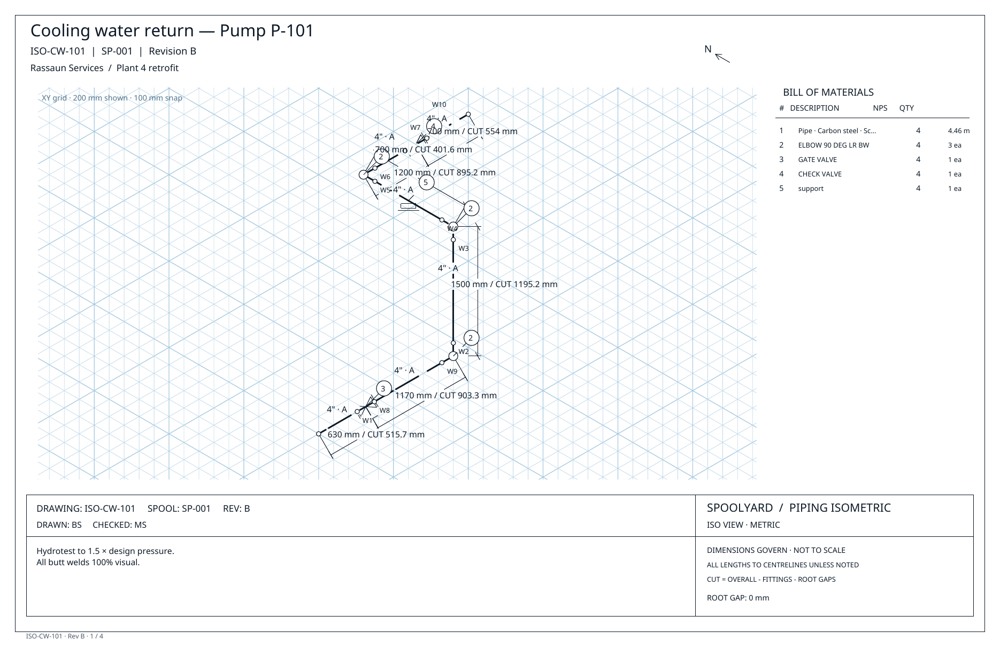

<p align="center">
  <picture>
    <source media="(prefers-color-scheme: dark)" srcset="assets/spoolyard-logo-dark.svg" />
    
  </picture>
</p>

<p align="center">
  <a href="https://braedonsaunders.github.io/spoolyard/"><b>Open in the browser</b></a> ·
  <a href="https://github.com/braedonsaunders/spoolyard/releases/latest"><b>Download for macOS / Windows</b></a> ·
  <a href="#embedding">Embed it</a>
</p>

<p align="center">
  <a href="https://github.com/braedonsaunders/spoolyard/actions/workflows/ci.yml"></a>
  <a href="LICENSE"></a>
</p>

Spoolyard is an open-source editor for piping isometrics and spool fabrication drawings. You route pipe by
measured length on isometric paper, place fittings from a pipe specification, and get the cut lengths, weld map
and bill of materials that come out of the geometry — then issue the drawing package as PDF, DXF, DWG or PCF.

It runs in the browser, as a desktop app, and inside [BidWright](https://github.com/braedonsaunders/bidwright),
where it powers piping isometrics in Files and Tools.





## What it does

- **Measured routing.** Click along the six iso directions with Ortho on, or type a length and pick East, North
  or Up. Bends and branches get the specification's elbows and tees automatically; rolling offsets route in XYZ.
- **Cut lengths you can build from.** Each pipe's cut is the centreline length less fitting takeouts and root
  gaps, per end preparation (butt-weld, socket-weld, threaded, plain).
- **Specifications with real rows.** Eleven carbon- and stainless-steel specifications ship ready to use, with
  about 15,000 rows of ASME B16 dimensions: pipe, elbows and returns, tees, crosses and laterals, reducers and
  swages, caps and plugs, couplings and unions, olets, flanges, gaskets and bolting, valves and supports. Every
  row is editable; add your own specifications, sizes and components.
- **168 components and symbols** in the component library, each drawn on the sheet with its own symbol.
- **Weld map and BOM.** Shop and field welds are numbered (numeric or alphabetic, with your own tags), and the
  bill of materials keeps heat numbers, specs and measured fittings distinct.
- **Paper or model space.** Draw directly on a tabloid, letter, A3 or A4 sheet with an editable title block, or
  switch to an infinite isometric grid. A 3D review checks the routing.
- **Outputs.** A full-page PDF package (one sheet per spool and view, plus material, cut and weld schedules),
  DXF and native DWG, PCF for plant-design tools, SVG, and CSV schedules.

| Specifications | Component library |
| --- | --- |
|  |  |



## Get it

- **Browser:** <https://braedonsaunders.github.io/spoolyard/> — drawings are kept on your device.
- **Desktop:** installers for macOS (Apple silicon and Intel), Windows and Linux are on the
  [releases page](https://github.com/braedonsaunders/spoolyard/releases/latest). The desktop app opens and saves
  `.piping` files directly and registers itself for them. The builds are not code-signed yet: on macOS,
  right-click the app and choose **Open** the first time; on Windows, choose **More info → Run anyway**.

## Run from source

```sh
pnpm install
pnpm dev          # web app on http://localhost:5173
pnpm test         # geometry, fabrication and library tests
pnpm desktop      # build and launch the desktop app
pnpm dist:mac     # or dist:win — installers in release/
```

## Embedding

The same build runs inside other applications in an iframe. Serve `dist/` from your origin (for example under
`/spoolyard/`) and load:

```
/spoolyard/index.html?embed=1&file=<url of the .piping file>&name=<file name>&theme=dark
```

In embedded mode the host draws the header and Spoolyard talks to it with `postMessage` (same origin only):

| From Spoolyard (`source: "spoolyard"`) | Meaning |
| --- | --- |
| `spoolyard:ready` | The editor has mounted. |
| `spoolyard:status` `{ status, error }` | `opening`, `saved`, `unsaved`, `saving` or `error`. |
| `spoolyard:save` `{ id, content }` | Autosave: write `content`, then reply with `spoolyard:saved` or `spoolyard:save-failed` and the same `id`. |

| From the host (`source: "spoolyard-host"`) | Meaning |
| --- | --- |
| `spoolyard:saved` / `spoolyard:save-failed` `{ id, error? }` | Result of a save. |
| `spoolyard:save-now` | Save immediately. |
| `spoolyard:theme` `{ theme: "light" \| "dark" }` | Follow the host's theme. |

An empty file opens as a new drawing and is saved straight back, so a host can create a drawing by creating an
empty `.piping` file.

## File format

A `.piping` file is JSON (`"schema": "bidwright-piping"`, version 1): the title block, the embedded
specifications, and the measured nodes and pipe runs in millimetres. Embedding the specifications keeps every
drawing self-contained. DXF exports carry the same model in an XRECORD, so Spoolyard can reopen its own DXF.

## License

[AGPL-3.0](LICENSE). DWG export uses [GNU LibreDWG](https://www.gnu.org/software/libredwg/) compiled to
WebAssembly (GPL-3.0, see `public/dwg-export/COPYING`); PDFs embed Noto Sans (SIL Open Font License, see
`public/fonts/LICENSE`).
